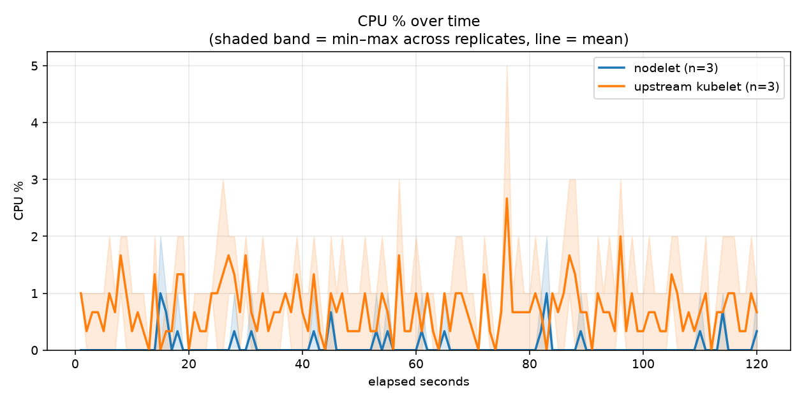

# not-k8s profiling results

Measured idle resource footprint: **nodelet** vs a **real, standalone
upstream kubelet**, on the same stripped `k3s server --disable-agent`
control plane and the same containerd — only the node agent differs.

## Latest result

**[latest/README.md](latest/README.md)** — commit `a6a7607ec299`, [workflow run](https://github.com/centerionware/not-k8s/actions/runs/31248852231).




## Methodology

- 6 GitHub Actions runners, provisioned identically and in parallel: 3
  replicates each of `agent: [nodelet, kubelet]`
  (`.github/workflows/profiling.yml`).
- Every runner installs via the real standalone installer (the
  `install-scripts` branch's `install.sh`, `--with-cri`) — the actual
  published release binary, not a from-source build. Nodelet legs stop
  there. Kubelet legs add `--skip-nodelet`: nodelet is never built,
  installed, or started on those runners at all — only the control plane
  + containerd + CNI come up, and `deploy/lib/upstream-kubelet.sh` then
  installs a real kubelet binary, version-matched to that runner's own
  k3s-embedded Kubernetes release, against that same stack.
- After a 30s settle, `deploy/measure.sh` samples RSS and CPU **every
  second** for the sample window, per process, writing a real per-second
  CSV. CPU-seconds (real processor time consumed) is the primary CPU
  metric, not %, which is noisy at near-idle utilization — perf's
  `task-clock` is used for sub-millisecond precision where available,
  falling back to `/proc`-derived ticks otherwise. Real hardware
  cycles/instructions are captured via `perf stat` when the runner's
  `perf_event` access allows it — confirmed unavailable on GitHub's own
  hosted runners (no PMU passthrough to the guest for attach-mode
  profiling), so this is usually N/A there.
- A final job downloads all 6 runners' data, aggregates the 3 replicates
  per agent (mean, min–max range), and renders the charts + report
  (`deploy/lib/render-profiling-charts.py`, `deploy/lib/profiling-report.sh`).

Every run's full output (report, charts, and all raw per-replicate CSVs
under `raw-data/`) is kept at `history/<YYYY-MM-DD_HH-MM-SS>/`; `latest/`
mirrors the most recent one.

## Run this yourself

```
sudo ./deploy/measure.sh 120                             # current node agent
sudo systemctl stop nodelet.service
sudo bash deploy/lib/upstream-kubelet.sh start            # swap in a real kubelet
sudo ./deploy/measure.sh 120 /tmp/out /usr/local/bin/kubelet
```

Or dispatch `gh workflow run profiling.yml`.
