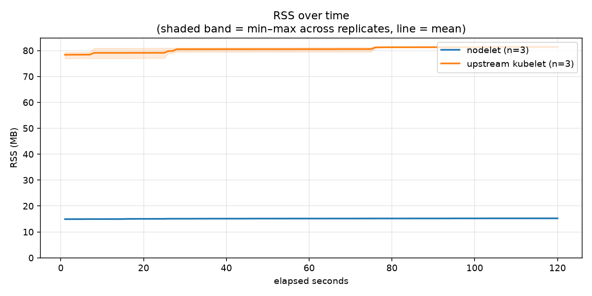

# Idle resource footprint: nodelet vs a real upstream kubelet

Same stripped `k3s server --disable-agent` control plane, same containerd
— only the node agent differs. 3 independent, identically-provisioned
runners per agent (6 total, measured in parallel); the table below is the
real mean and min–max range across replicates, not a single point
estimate.

Commit `a6a7607ec299` · sample window 120s, 1 sample/sec, 3 replicates/agent · [workflow run](https://github.com/centerionware/not-k8s/actions/runs/31248852231)

**Test hardware:**

- **nodelet**: x86_64, 4 cores, `AMD EPYC 7763 64-Core Processor`
- **nodelet**: x86_64, 4 cores, `AMD EPYC 9V74 80-Core Processor`
- **nodelet**: x86_64, 4 cores, `INTEL(R) XEON(R) PLATINUM 8573C`
- **upstream kubelet**: x86_64, 4 cores, `AMD EPYC 7763 64-Core Processor`
- **upstream kubelet**: x86_64, 4 cores, `AMD EPYC 9V74 80-Core Processor`
- **upstream kubelet**: x86_64, 4 cores, `INTEL(R) XEON(R) PLATINUM 8573C`

| agent | RSS (MB) | CPU-seconds used | avg CPU % | cycles | instructions | IPC |
|---|---|---|---|---|---|---|
| **nodelet** | 15.2 (range 15.2–15.3, n=3) | 0.080 (range 0.070–0.090, n=3) | 0.07 (range 0.06–0.07, n=3) | N/A | N/A | N/A |
| **upstream kubelet** | 81.4 (range 81.2–81.5, n=3) | 0.850 (range 0.650–1.020, n=3) | 0.71 (range 0.54–0.85, n=3) | N/A | N/A | N/A |

Individual replicate runs

| agent | replicate | RSS (MB) | CPU-seconds used | avg CPU % | cycles | instructions | IPC |
|---|---|---|---|---|---|---|---|
| nodelet | 1 | 15.3 | 0.090 | 0.07 | N/A | N/A | N/A |
| nodelet | 2 | 15.2 | 0.080 | 0.07 | N/A | N/A | N/A |
| nodelet | 3 | 15.2 | 0.070 | 0.06 | N/A | N/A | N/A |
| upstream kubelet | 1 | 81.2 | 0.880 | 0.73 | N/A | N/A | N/A |
| upstream kubelet | 2 | 81.4 | 0.650 | 0.54 | N/A | N/A | N/A |
| upstream kubelet | 3 | 81.5 | 1.020 | 0.85 | N/A | N/A | N/A |

## Over time

Shaded band = min–max across the 3 replicates, line = mean.

## Raw data

Full 1-second-resolution CSVs and `deploy/measure.sh`'s complete
human-readable + machine-readable output, per replicate, under
`raw-data/`:

- `raw-data/nodelet-1`/`nodelet-2`/`nodelet-3`-{timeseries,k3s-server-timeseries,summary}
- `raw-data/kubelet-1`/`kubelet-2`/`kubelet-3`-{timeseries,k3s-server-timeseries,summary}
