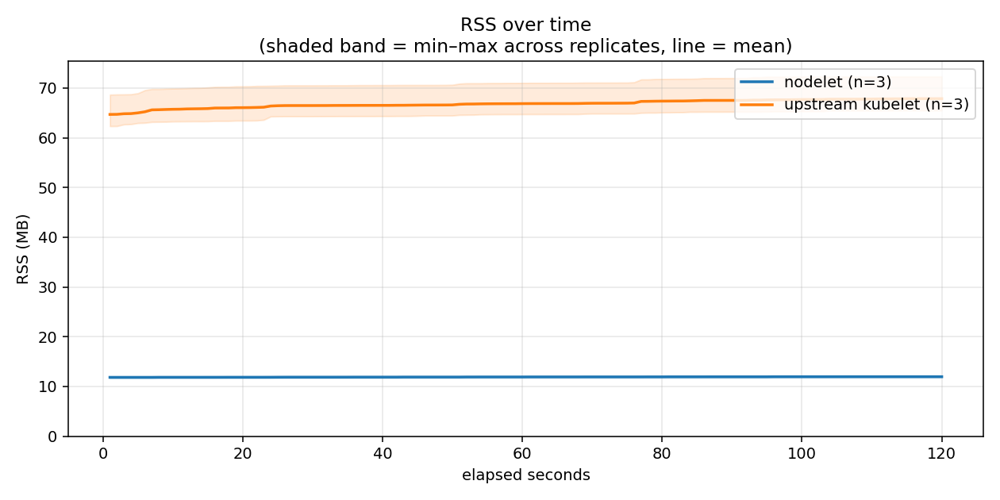
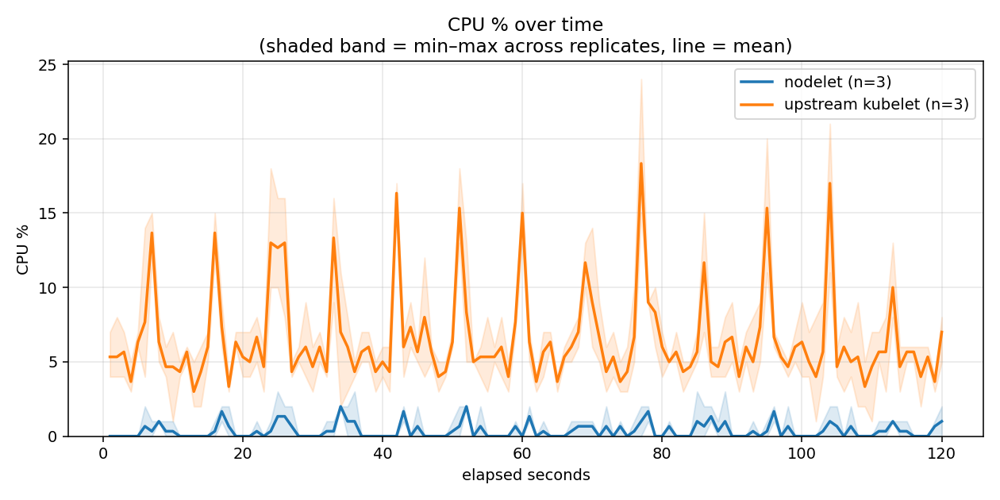

# Idle resource footprint on ARM phone hardware: nodelet vs a real upstream kubelet

Same stripped `k3s server --disable-agent` control plane, same containerd
— only the node agent differs.

**This is a manual run on real ARM phone hardware, not the CI x86_64 run.**
The canonical CI numbers live in [`latest/`](../../latest/) and are
unaffected by this run.

| | |
|---|---|
| Device | Google Pixel 7 (Tensor G2), Debian VM under KVM |
| CPU | Cortex-A55 + Cortex-X1 (8 cores visible to the guest) |
| RAM | 1963 MB (guest) |
| Kernel | `6.12.89-android16-6-gf222c1f727d9-ab15712176-4k` |
| Arch | aarch64 |
| k3s | `v1.36.3+k3s1` |
| nodelet | published aarch64 release binary, fetched by `install-scripts/install.sh` |

Commit `d16811d8d5a9` · sample window 120s, 1 sample/sec, 3 replicates/agent

**Test hardware:**

- **nodelet**: aarch64, 8 cores, `unknown`
- **upstream kubelet**: aarch64, 8 cores, `unknown`

| agent | RSS (MB) | CPU-seconds used | avg CPU % | cycles | instructions | IPC |
|---|---|---|---|---|---|---|
| **nodelet** | 12.0 (range 11.8–12.1, n=3) | 0.436 (range 0.393–0.461, n=3) | 0.36 (range 0.34–0.38, n=3) | N/A | N/A | N/A |
| **upstream kubelet** | 67.9 (range 65.5–72.3, n=3) | 8.031 (range 7.778–8.170, n=3) | 6.56 (range 6.43–6.67, n=3) | N/A | N/A | N/A |

<details><summary>Individual replicate runs</summary>

| agent | replicate | RSS (MB) | CPU-seconds used | avg CPU % | cycles | instructions | IPC |
|---|---|---|---|---|---|---|---|
| nodelet | 1 | 12.1 | 0.461 | 0.38 | N/A | N/A | N/A |
| nodelet | 2 | 12.0 | 0.393 | 0.34 | N/A | N/A | N/A |
| nodelet | 3 | 11.8 | 0.455 | 0.37 | N/A | N/A | N/A |
| upstream kubelet | 1 | 72.3 | 8.170 | 6.57 | N/A | N/A | N/A |
| upstream kubelet | 2 | 65.5 | 7.778 | 6.43 | N/A | N/A | N/A |
| upstream kubelet | 3 | 65.8 | 8.147 | 6.67 | N/A | N/A | N/A |

</details>

## Over time





Shaded band = min–max across the 3 replicates, line = mean.

## What this run actually shows

**1. The efficiency gap widens on weak cores.** On x86_64 CI the CPU-seconds
ratio is roughly 10x; here it is roughly 18x. The polling work is fixed, so
a slower core spends proportionally more of itself on it — and kubelet, which
does far more of that polling, degrades harder than nodelet does. The RSS
ratio is close to flat between the two platforms (~5.4x on x86_64, ~5.7x
here), which is expected: resident memory is not a function of core speed.

**2. On this hardware the control plane, not the node agent, is the
dominant cost.** The stripped `k3s server --disable-agent` control plane
measured ~34% of a core (~41.5 CPU-seconds per 120s window) and ~350-370 MB
RSS in every leg, regardless of which node agent was running beside it. That
is roughly 5x kubelet's own CPU cost and ~95x nodelet's. Swapping the node
agent is a real saving, but anyone reading these numbers should be clear
that it does not touch the larger item on the bill. Replacing the node agent
is the part this project has done; the control plane is not in scope today.

**3. The ~30-50%-of-a-core figure for a k3s stack on phone hardware is
consistent with this run** — measured at 33.2-36.2% across six independent
legs, for the control plane alone.

## Methodology, and how it differs from the CI run

Each leg provisions itself through the real standalone installer
(`install-scripts` branch's `install.sh`, `--with-cri`) — the actual
published release binary for aarch64, not a from-source build. Kubelet
legs add `--skip-nodelet`, so nodelet is never built, installed, or
started on those legs at all; `deploy/lib/upstream-kubelet.sh` then
installs a real upstream kubelet binary, version-matched to this
cluster's own k3s-embedded Kubernetes release, against the same control
plane and the same containerd. After a 30s settle, `deploy/measure.sh`
samples RSS and CPU every second for the window.

**Where this is weaker than CI, stated plainly:**

- **Sequential, not parallel.** CI runs all 6 legs simultaneously on 6
  separate, identically-provisioned runners precisely so that ordering
  effects (page cache, memory fragmentation, thermal state) cannot
  advantage whichever agent ran second. There is only one phone here, so
  the legs ran one after another. Two partial mitigations were applied:
  the agents were **interleaved** (nodelet-1, kubelet-1, nodelet-2,
  kubelet-2, …) so monotonic drift hits both roughly equally rather than
  systematically favoring the one that ran cold, and every leg was
  preceded by a full teardown (`k3s-uninstall.sh`) plus a 60s cooldown.
  This is a mitigation, not an equivalent — treat the ARM numbers as
  indicative, and the x86_64 CI numbers as the methodologically stronger
  measurement.
- **Thermal throttling is a live confounder.** This is a passively cooled
  phone SoC with heterogeneous cores (Cortex-X1 big + Cortex-A55 little).
  Sustained load can migrate work between core types and downclock it;
  neither is visible in RSS or CPU-seconds.
- **Virtualized.** The guest is a KVM VM on Android, not bare metal, so
  absolute figures include hypervisor overhead.
- **Single device, one session.** No cross-device replication.

## Raw data

Full 1-second-resolution CSVs and `deploy/measure.sh`'s complete
human-readable + machine-readable output, per replicate, under
`raw-data/`.

## Reproduce

```
sudo ./deploy/measure.sh 120                              # current node agent
sudo systemctl stop nodelet.service
sudo bash deploy/lib/upstream-kubelet.sh start             # swap in a real kubelet
sudo ./deploy/measure.sh 120 /tmp/out /usr/local/bin/kubelet
```
