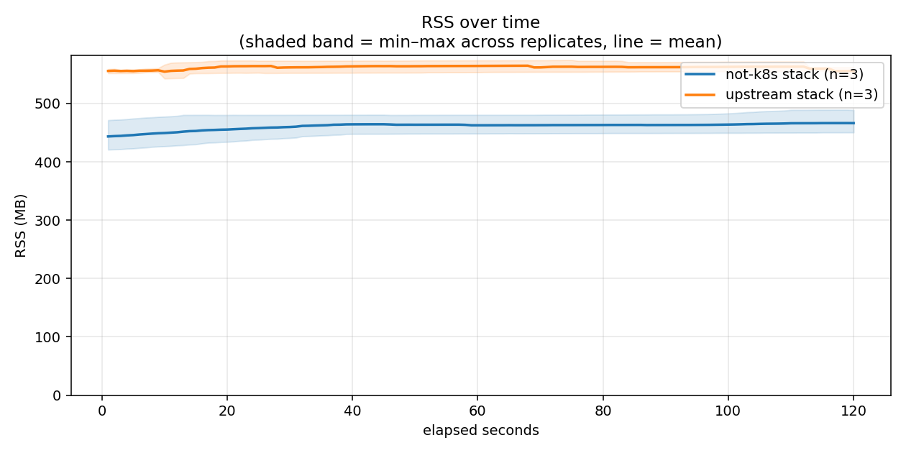
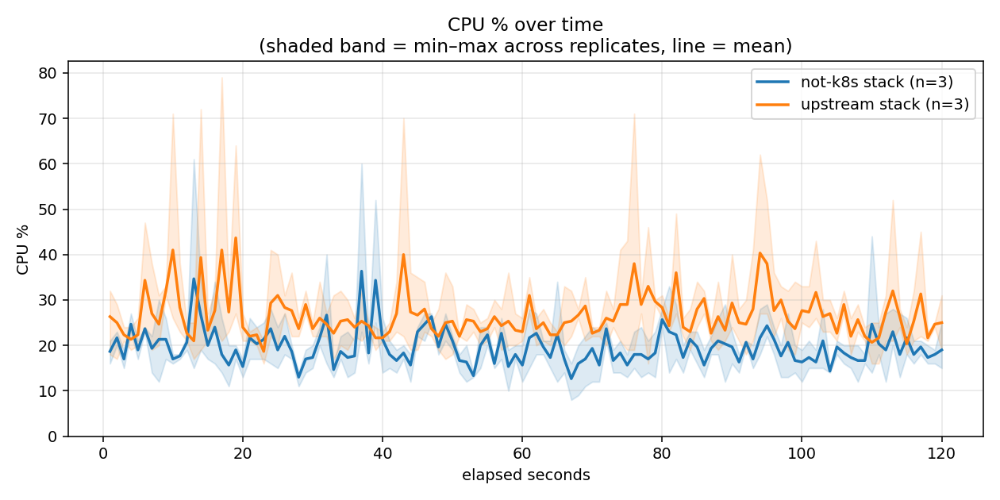
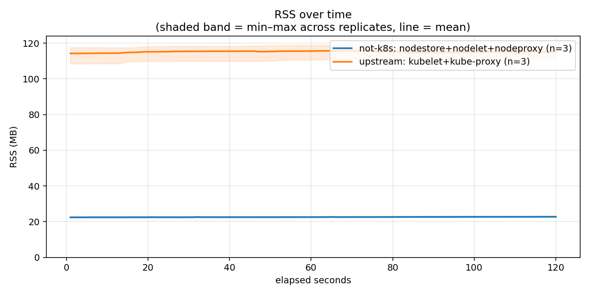
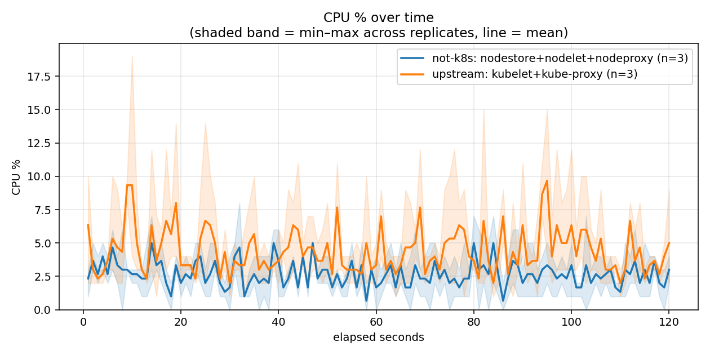

# Whole-stack idle footprint on ARM phone hardware: not-k8s vs upstream

The same stripped `k3s server --disable-agent` control plane on both sides.
Only the node and datastore components differ, and they differ one-for-one:

| role | upstream leg | not-k8s leg |
|---|---|---|
| node agent | real upstream `kubelet` v1.36.3 | `nodelet` |
| Service routing | real upstream `kube-proxy` v1.36.3 | `nodeproxy` |
| datastore | `kine` + SQLite (in the k3s process) | `nodestore` |
| container runtime | containerd 1.7.24 | *same* |
| CNI | flannel | *same* |

**This is a manual run on real ARM phone hardware, not the CI x86_64 run.**
The canonical CI numbers live in [`latest/`](../../latest/) and are unaffected
by this run.

**This is also a different measurement from every earlier run in this
branch.** The published history compares *one node agent process* against
another (`nodelet` vs `kubelet`, both with `--proxy=none`, both on kine).
This run compares *whole stacks*, every process counted on both sides — which
is the comparison the earlier runs' own notes said "would need a real
kube-proxy on the other side and a measure.sh that sums multiple PIDs".
Both of those now exist (`deploy/lib/upstream-kube-proxy.sh`, and
`deploy/measure.sh`'s component table). Do not read these numbers as
continuous with the agent-only history.

| | |
|---|---|
| Device | Google Pixel 7 (Tensor G2), Debian VM under KVM |
| CPU | 8 cores visible to the guest |
| RAM | 1963 MB (guest) |
| Kernel | `6.12.89-android16-6-gf222c1f727d9-ab15712176-4k` |
| Arch | aarch64 |
| k3s | `v1.36.3+k3s1` |
| upstream kubelet / kube-proxy | `v1.36.3` — the exact upstream version k3s embeds |
| not-k8s | aarch64 release build of `9a718325fe09` (branch `nodestore`) |

Sample window 120s at 1 sample/sec, 3 replicates per leg. Each replicate is a
**fresh install**, and the legs alternate
(`ours → upstream → ours → upstream → ours → upstream`) so host drift lands on
both legs equally rather than on whichever ran last. Idle, empty cluster.

## Whole stack

Every process on the node, summed: control plane, datastore, node agent,
Service proxy, containerd and flannel.

| leg | RSS (MB) | CPU-seconds / 120s | avg CPU % |
|---|---|---|---|
| **not-k8s** | **468.4** (450.4–489.7) | **24.98** (23.78–25.87) | 19.68 |
| **upstream** | 572.4 (564.8–576.3) | 37.16 (33.75–43.07) | 26.60 |
| | −18% | **−33%** | |

Shaded band = min–max across the 3 replicates, line = mean.

## Per component

| leg | component | RSS (MB) mean | RSS range | CPU-sec mean | CPU-sec range |
|---|---|---|---|---|---|
| not-k8s | `k3s` | 360.0 | 343.7–380.9 | 18.039 | 16.959–18.897 |
| not-k8s | `nodestore` | 10.1 | 9.9–10.5 | 2.638 | 2.433–2.783 |
| not-k8s | `nodelet` | 8.7 | 8.7–8.8 | 0.440 | 0.415–0.454 |
| not-k8s | `nodeproxy` | 4.0 | 4.0–4.0 | 0.006 | 0.005–0.008 |
| not-k8s | `containerd` | 51.5 | 48.7–54.2 | 0.819 | 0.755–0.869 |
| not-k8s | `flanneld` | 34.0 | 32.5–36.8 | 3.042 | 2.933–3.214 |
| not-k8s | **COMBINED** | **468.4** | 450.4–489.7 | **24.984** | 23.781–25.868 |
| upstream | `k3s` | 371.6 | 369.8–373.8 | 23.605 | 21.927–26.699 |
| upstream | `kubelet` | 71.6 | 67.6–73.7 | 5.229 | 4.626–6.003 |
| upstream | `kube-proxy` | 44.8 | 43.8–45.7 | 0.307 | 0.247–0.371 |
| upstream | `containerd` | 47.9 | 46.2–50.8 | 4.589 | 3.942–5.762 |
| upstream | `flanneld` | 36.5 | 35.8–36.8 | 3.432 | 2.948–4.233 |
| upstream | **COMBINED** | **572.4** | 564.8–576.3 | **37.163** | 33.748–43.068 |

## The components each project actually ships

Excluding the shared control plane, containerd and flannel — this is the part
the two projects genuinely differ in.

| leg | components | RSS (MB) | CPU-seconds / 120s |
|---|---|---|---|
| **not-k8s** | `nodestore` + `nodelet` + `nodeproxy` | **22.8** (22.6–23.3) | **3.08** (2.85–3.24) |
| **upstream** | `kubelet` + `kube-proxy` (+ kine, inside k3s) | 116.4 (111.4–119.2) | 5.54 (4.93–6.37) |
| | | **5.1x less** | **1.8x less** |

The upstream row understates itself: kine is not a separate process, so its
cost is inside the `k3s` row above and cannot be added here. The `k3s` row is
the place to see it — 23.61 CPU-seconds with kine, 18.04 without it, on an
otherwise identical control plane.

## What this run actually shows

**1. Measuring only the agent hid a third of the difference.** `containerd`
is the same binary, same version, same config on both legs — and it burns
**4.59 CPU-seconds under kubelet against 0.82 under nodelet**, 5.6x. That is
kubelet's PLEG polling arriving as CRI calls: work kubelet causes but does not
spend, so it never appeared in any agent-only measurement this project has
published. It is the single strongest argument for the whole-stack table.

**2. `flanneld` is the control.** 3.04 vs 3.43 CPU-seconds, 34.0 vs 36.5 MB —
the same component doing the same job on both legs, and it measures the same
on both. A rig that produced a large difference here would be measuring itself,
not the stacks.

**3. The node side is where the ratios are large, and it is the smaller
number.** 22.8 MB against 116.4 MB is a 5.1x difference, but in whole-stack
terms it is 94 MB of a 104 MB gap — because everything else on the node is
either shared or still k3s. The remaining footprint is overwhelmingly the
control plane, which is exactly what `nodestore` started on and what
`nodeapiserver`/`nodescheduler` would continue.

**4. nodestore costs more CPU than nodelet and nodeproxy combined, and it is
still the right trade.** 2.64 CPU-seconds against 0.45 and 0.006. It replaces
kine, whose cost sits in the k3s row, and the k3s row drops by 5.57
CPU-seconds when nodestore takes over — so the datastore swap is roughly
5.57 out and 2.64 back, a net win of ~2.9 CPU-seconds per 120s window. Not
the order-of-magnitude the node agent shows; a real win nonetheless, and it is
measured rather than assumed.

**5. The upstream leg is noisier.** Its CPU-seconds range across replicates is
33.75–43.07 (a 28% spread) against 23.78–25.87 (9%) for not-k8s. Three
replicates is not enough to call that a property of the software rather than
of the host, but it is consistent with polling loops landing differently
relative to a fixed window, which is the failure mode event-driven
reconciliation does not have.

## Caveats, stated rather than implied

- **kube-proxy runs in iptables mode, nodeproxy in nftables.** That is what
  each ships by default, so it is a comparison of defaults, not of
  implementations. Forcing kube-proxy to nftables would measure a
  configuration nobody runs — and on this kernel the modules its nftables
  backend wants are missing anyway.
- **No pods, no Services.** Both proxies are idle with nothing to route;
  neither number says anything about routing under load.
- **The `k3s` row is a remainder**, not a component. It holds apiserver,
  controller-manager, scheduler, and kine on the upstream leg. Attributing
  its difference entirely to kine is the obvious reading and probably close to
  right, but it is an inference, not a measurement.
- **Hardware performance counters were unavailable** (`cycles`/`instructions`
  are N/A throughout); CPU-seconds come from perf's `task-clock` software
  event, which is sub-millisecond precise and is the primary metric here.
- **3 replicates.** Ranges are shown everywhere rather than point estimates
  alone; treat differences smaller than the ranges as noise.

Raw per-second CSVs and the full `measure.sh` summaries for all six
deployments are in [`raw-data/`](raw-data/).
