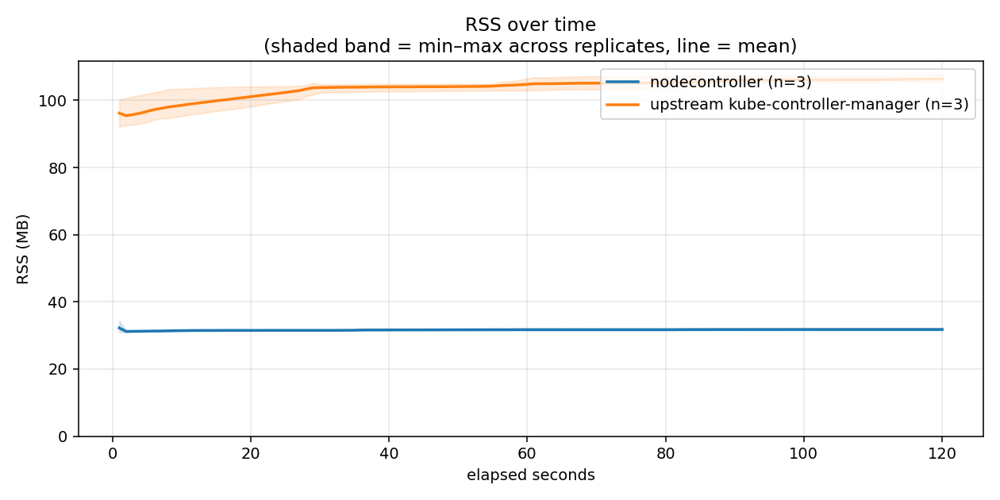
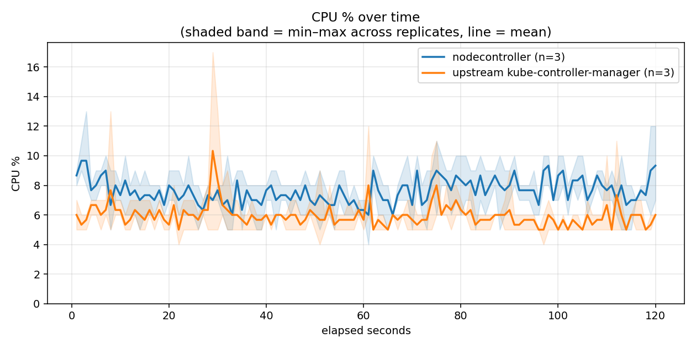

# nodecontroller vs a real upstream kube-controller-manager on ARM phone hardware

Same stripped `k3s server --disable-agent` control plane, same containerd —
only the controller-manager differs. The full not-k8s stack was running
throughout both legs (`nodestore` as the datastore, `nodescheduler` placing
pods, `nodeproxy` for Service routing, `nodelet` as the node agent) — this
is "our whole stack with the controller-manager swapped," not an isolated
component in an otherwise-empty cluster. One demo pod (`smoke-test`,
`busybox:latest sleep 3600`) plus CoreDNS were Running throughout, on a
single-node cluster with a live, heartbeating Node.

**This is a manual run on real ARM phone hardware.** The canonical CI
comparison (`nodelet` vs `kubelet`) lives in
[`latest/`](../../latest/README.md) and is unaffected by this run.

**Methodology: 6 legs, alternating, not blocked.** ours → theirs → ours →
theirs → ours → theirs, rather than three-then-three — this controls for
any monotonic drift across the ~17-minute session (thermal state, memory
fragmentation, anything else that accumulates over time) biasing whichever
side happened to run first or second as a block.

| | |
|---|---|
| Device | Google Pixel 7 (Tensor G2), Debian VM under KVM |
| CPU | aarch64, 8 cores |
| RAM | 1963 MB (guest) |
| k3s | `v1.36.3+k3s1` |
| not-k8s | release `v0.6.0` (commit `fc2081f6a967`), split layout, fetched via `deploy/bootstrap-release.sh` |
| upstream kube-controller-manager | `v1.36.3` — the exact upstream version k3s embeds, fetched fresh from `dl.k8s.io` |
| Sample window | 120s, 1 sample/sec, 3 replicates/agent (6 legs total) |

**Test hardware:**

- **nodecontroller**: aarch64, 8 cores, model unreported by `/proc/cpuinfo` on this board (same as every prior ARM run in this branch's history)
- **upstream kube-controller-manager**: aarch64, 8 cores, model unreported

| agent | RSS (MB) | CPU-seconds used | avg CPU % | cycles | instructions | IPC |
|---|---|---|---|---|---|---|
| **nodecontroller** | 32.5 (range 31.5–34.4, n=3) | 8.817 (range 8.585–9.243, n=3) | 7.62 (range 7.47–7.84, n=3) | N/A | N/A | N/A |
| **upstream kube-controller-manager** | 106.4 (range 105.4–107.8, n=3) | 7.691 (range 7.506–8.004, n=3) | 5.94 (range 5.85–6.00, n=3) | N/A | N/A | N/A |

<details><summary>Individual replicate runs</summary>

| agent | replicate | RSS (MB) | CPU-seconds used | avg CPU % |
|---|---|---|---|---|
| nodecontroller | 1 | 31.5 | 9.243 | 7.84 |
| nodecontroller | 2 | 34.4 | 8.585 | 7.47 |
| nodecontroller | 3 | 31.7 | 8.623 | 7.55 |
| upstream kube-controller-manager | 1 | 107.8 | 7.563 | 5.85 |
| upstream kube-controller-manager | 2 | 105.4 | 7.506 | 6.00 |
| upstream kube-controller-manager | 3 | 106.0 | 8.004 | 5.98 |

</details>

cycles/instructions/IPC are N/A for both agents despite `perf` reporting
hardware counters "available" on this host — consistent with every prior
report in this branch's history (see e.g. `history/2026-08-08_08-42-56/`),
where the same fields are N/A even on a GitHub-hosted x86_64 runner. This
looks like a per-PID `perf stat -p <pid>` limitation broader than the
coarse `perf stat -e cycles -- true` self-check `measure.sh` uses to decide
counters are "available" — CPU-seconds (task-clock, sub-millisecond
precision) remains the reliable primary CPU metric on every run to date,
here and in CI.

## Over time





Shaded band = min–max across the 3 replicates, line = mean.

## What this run actually shows

- **RSS: a clean, decisive, ~3.3x win for nodecontroller** (32.5 MB vs
  106.4 MB) — and the RSS-over-time chart shows both lines essentially flat
  for the full 120s window with no overlap between the min–max bands across
  any of the 6 replicates. This is the more structural of the two numbers:
  how much of each Pod/Node/etc. object each implementation retains, not a
  transient effect of what happened to be running during the window.

- **CPU-seconds: nodecontroller used *more*, not less** (8.8s vs 7.7s over
  120s — roughly 15% higher), and the CPU-over-time chart shows
  nodecontroller's line sitting above upstream's for essentially the entire
  window, not just at startup. This is the honest, non-flattering half of
  the result and is reported as measured rather than only publishing the
  RSS win.

  A plausible, source-grounded explanation (not confirmed by this
  measurement alone — this run captures aggregate CPU%, not a profiled
  breakdown of where the time goes): `crates/nodecontroller/src/config.rs`
  defines a 100ms recurring timer-wheel tick
  (`defaults::TICK_PERIOD_MILLIS`) that runs continuously regardless of
  whether any deadline is actually due, for controllers whose behavior is
  deadline-driven (node-lifecycle grace periods, lease staleness, etc. —
  "event controllers do not poll on this cadence," per that same file's
  comment, so this is not the *whole* CPU story). Ten wakeups/second,
  forever, is a small but non-zero and *constant* cost that a purely
  event/watch-driven design wouldn't pay at all — which would explain a
  steady, whole-window elevation rather than a startup-only spike, matching
  what the chart actually shows. Confirming this precisely would need a
  real CPU profile (flamegraph) of nodecontroller's idle process, which is
  future work, not part of this run.

- **Upstream's periodic spikes** (visible in the CPU chart around ~29s,
  ~61s, ~75s, ~112s — roughly 30-45s apart) look like a resync/relist cycle
  on one of its many built-in controllers. No flag was passed to upstream
  restricting which controllers run, so it started under its own full
  default set (deployment, replicaset, daemonset, statefulset, job,
  cronjob, hpa-adjacent, and more) — the fair, representative comparison
  (this is how a real deployment runs it), not a minimized configuration
  favoring one side.

## Caveats, stated rather than implied

- **Single device, one session, sequential legs, not parallel CI runners**
  — same hedge as every prior manual run on this box: ordering effects
  (thermal/page-cache state) are not ruled out the way 6-parallel-runner CI
  does. The alternating leg order (see Methodology above) is this run's
  specific mitigation for *monotonic* drift, not a substitute for
  independent hardware.
- **Full not-k8s stack running throughout, not an empty cluster** — see the
  top of this report. `nodestore`/`nodescheduler`/`nodeproxy`/`nodelet` are
  identical across both legs (no bias between them), but this is not a
  bare-metal isolated-component measurement.
- **cycles/instructions/IPC unavailable** — see the note under the table.
- **3 replicates** — ranges shown throughout; treat differences smaller
  than the shown range as noise. The RSS result (no overlap across 6
  replicates) clears that bar comfortably; the CPU-seconds gap (8.8 vs 7.7,
  ranges 8.585–9.243 vs 7.506–8.004) also does not overlap, so it is a real
  effect on this hardware, not noise — but "real on this run" is not the
  same claim as "true in general."
- **nodecontroller's own scope**: per `docs/CONTROLLER_MANAGER.md`, node
  lifecycle, workload controllers (replicaset/deployment/daemonset/
  statefulset), batch controllers (job/cronjob/ttl-after-finished),
  CSR/PKI, GC/quota, and more are all implemented — this is not a partial
  reimplementation being flattered by upstream doing more work upstream
  wasn't asked to do less of.

## Raw data

Full 1-second-resolution CSVs and `deploy/measure.sh`'s complete
human-readable + machine-readable output, per replicate, under
`raw-data/` — including the shared `k3s`/`nodestore`/`nodescheduler`/
`nodeproxy`/`nodelet`/`containerd`/`flanneld` rows each `measure.sh` call
also captured alongside the controller-manager under test.

## Reproduce

```
sudo ./deploy/measure.sh 120                                        # current controller-manager (nodecontroller)
sudo systemctl stop nodecontroller
sudo bash deploy/lib/upstream-kube-controller-manager.sh start       # swap in real kube-controller-manager
sudo ./deploy/measure.sh 120 /home/droid/out
sudo bash deploy/lib/upstream-kube-controller-manager.sh stop        # swap back
sudo systemctl start nodecontroller
```

Requires `CONTROLLER_MANAGER=nodecontroller` (or `--controller-manager=nodecontroller`
to `bootstrap-source.sh`/`bootstrap-release.sh`) to have been set at
bootstrap time, so k3s's own bundled controller-manager is disabled and
only one controller-manager is ever writing at a time.
