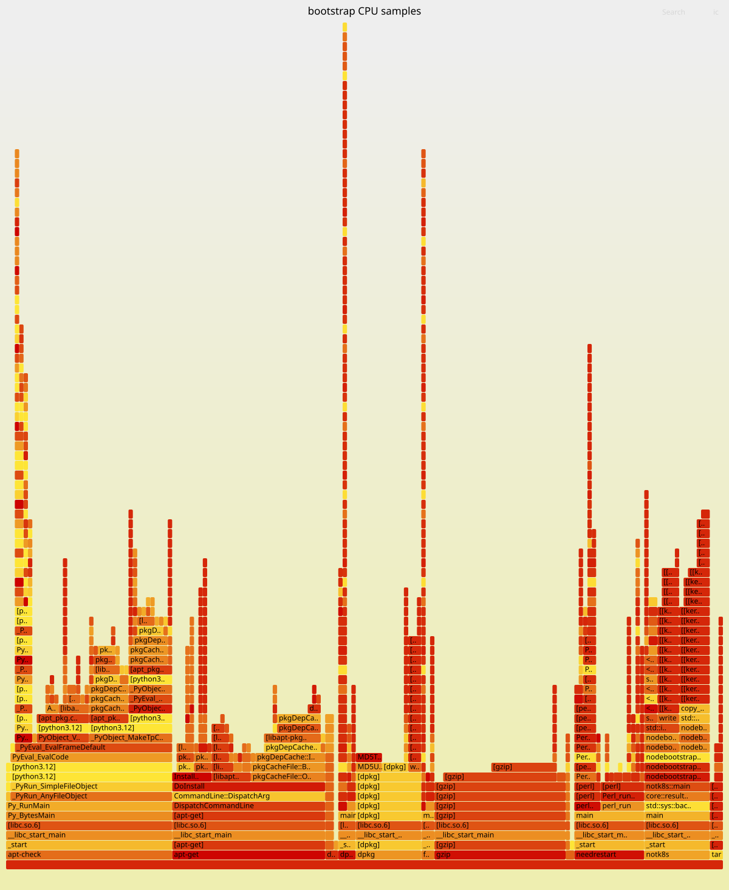

# Stack CPU profile

- Source: `f2aa65c679d88002f68c62b72f9dac84e3e9857e`
- Run: https://github.com/centerionware/not-k8s/actions/runs/33935693221
- Build: profiling; capture result: capture=failure,render=success
- Workload: heavy (see workload-config.json for parameters)
- Complete compressed bundle: 101674373 bytes; parts are below GitHub's per-file limit.

This is one single-node diagnostic sample, not conformance, a release performance
ratio, or a statistical benchmark. Six runtime PIDs are sampled together. The
bootstrap applet is captured separately. The load generator and perf share the
host. Inspect workload errors and restart checks before interpreting CPU numbers.

The archive includes raw perf data, decoded stacks, per-process CPU/RSS/PSS series,
workload operations, symbolized executable, build identity, and diagnostics.
An empty folded-stack file is reported as no samples, not zero CPU usage.

Download all parts and SHA256SUMS into an empty directory, then:

```sh
sha256sum -c SHA256SUMS
cat profile.tar.gz.part-* | tar -xz
```

Use the included matching executable with `perf report --symfs` if re-analyzing
on another host. The bundle retains the original absolute executable layout under
`symfs/`; rendered SVGs and text reports need no symbol setup.

## Browseable files

- [bootstrap/flamegraph.svg](bootstrap/flamegraph.svg)

## Charts and flame graphs

### bootstrap/flamegraph.svg



