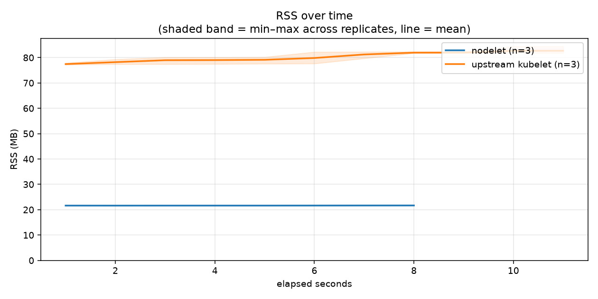
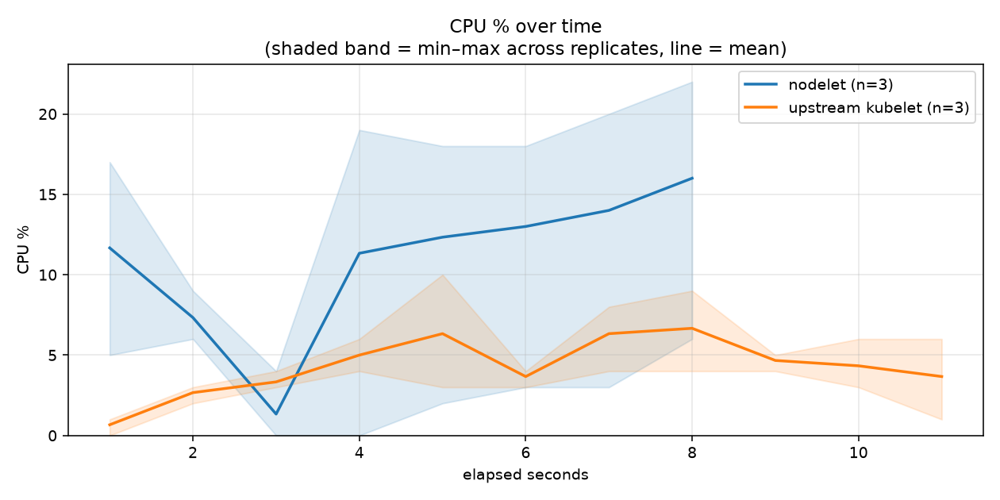
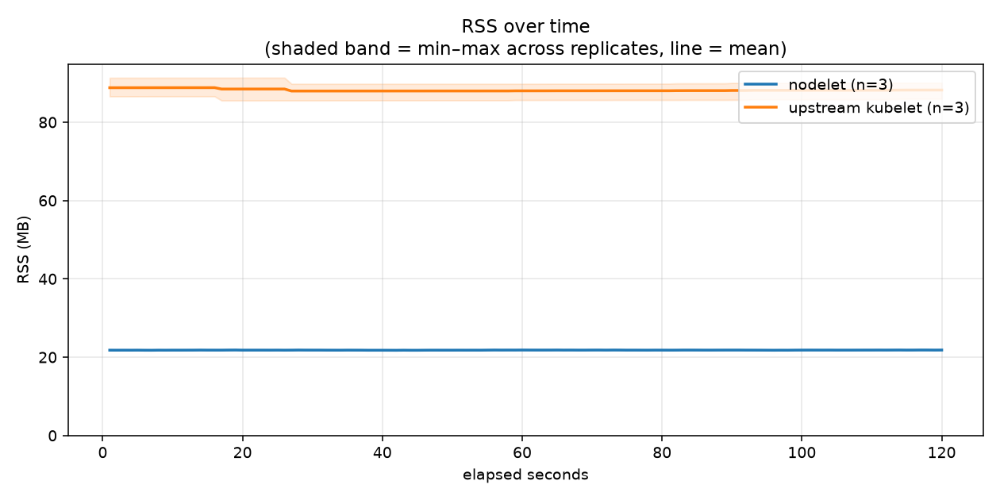
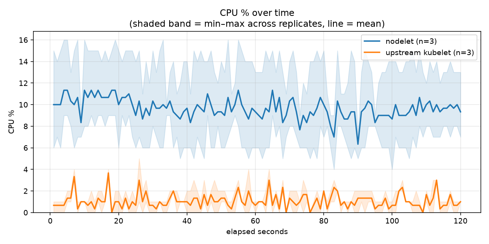
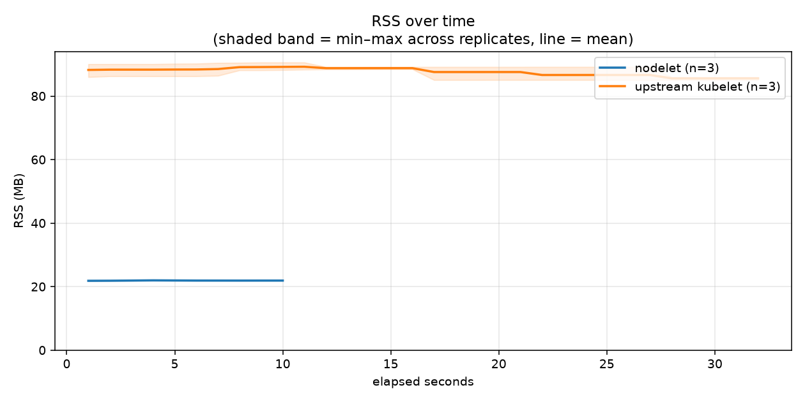
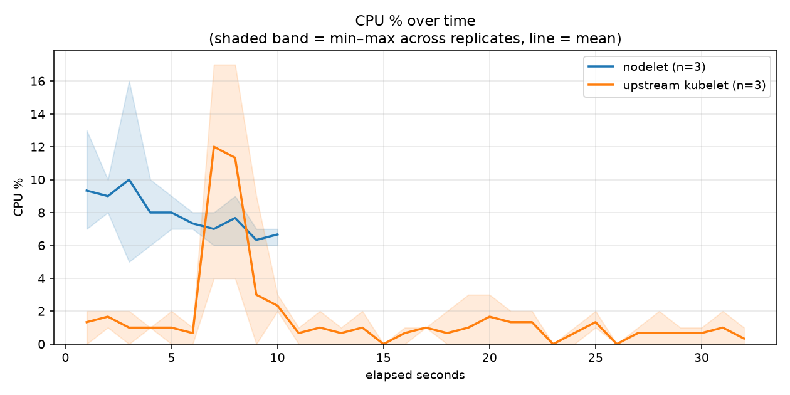

# Workload profiling: nodelet vs a real upstream kubelet

Same stripped `k3s server --disable-agent` control plane, same containerd
— only the node agent differs. 10 namespaces (one pod each) spun up,
120s idle with them running, then spun back down. 3 independent,
identically-provisioned runners per agent (6 total, measured in parallel);
each table below is the real mean and min–max range across replicates.

Commit `d5209f9e8323` · 10 pods · idle window 120s, 1 sample/sec, 3 replicates/agent · [workflow run](https://github.com/centerionware/not-k8s/actions/runs/32411009912)

## Spin-up: creating 10 pods/namespaces

**Time to healthy** — wall-clock from first `kubectl apply` to every pod's `Ready` condition:

| agent | time to healthy (s) |
|---|---|
| **nodelet** | 7.69 (range 7.00–8.63, n=3) |
| **upstream kubelet** | 11.11 (range 9.88–12.55, n=3) |

**Test hardware:**

- **nodelet**: x86_64, 4 cores, `AMD EPYC 9V74 80-Core Processor`
- **nodelet**: x86_64, 4 cores, `Intel(R) Xeon(R) 6973P-C`
- **nodelet**: x86_64, 4 cores, `Intel(R) Xeon(R) Platinum 8370C CPU @ 2.80GHz`
- **upstream kubelet**: x86_64, 4 cores, `AMD EPYC 7763 64-Core Processor`
- **upstream kubelet**: x86_64, 4 cores, `INTEL(R) XEON(R) PLATINUM 8573C`

| agent | RSS (MB) | CPU-seconds used | avg CPU % | cycles | instructions | IPC |
|---|---|---|---|---|---|---|
| **nodelet** | 21.7 (range 21.6–21.7, n=3) | 0.953 (range 0.530–1.240, n=3) | 11.47 (range 5.30–15.50, n=3) | N/A | N/A | N/A |
| **upstream kubelet** | 82.7 (range 81.8–84.5, n=3) | 0.483 (range 0.380–0.550, n=3) | 4.01 (range 3.45–4.58, n=3) | N/A | N/A | N/A |

Individual replicate runs

| agent | replicate | RSS (MB) | CPU-seconds used | avg CPU % | cycles | instructions | IPC |
|---|---|---|---|---|---|---|---|
| nodelet | 1 | 21.7 | 1.240 | 15.50 | N/A | N/A | N/A |
| nodelet | 2 | 21.6 | 0.530 | 5.30 | N/A | N/A | N/A |
| nodelet | 3 | 21.7 | 1.090 | 13.62 | N/A | N/A | N/A |
| upstream kubelet | 1 | 81.8 | 0.550 | 4.58 | N/A | N/A | N/A |
| upstream kubelet | 2 | 81.8 | 0.520 | 4.00 | N/A | N/A | N/A |
| upstream kubelet | 3 | 84.5 | 0.380 | 3.45 | N/A | N/A | N/A |

## Idle, with 10 pods running

**Test hardware:**

- **nodelet**: x86_64, 4 cores, `AMD EPYC 9V74 80-Core Processor`
- **nodelet**: x86_64, 4 cores, `Intel(R) Xeon(R) 6973P-C`
- **nodelet**: x86_64, 4 cores, `Intel(R) Xeon(R) Platinum 8370C CPU @ 2.80GHz`
- **upstream kubelet**: x86_64, 4 cores, `AMD EPYC 7763 64-Core Processor`
- **upstream kubelet**: x86_64, 4 cores, `INTEL(R) XEON(R) PLATINUM 8573C`

| agent | RSS (MB) | CPU-seconds used | avg CPU % | cycles | instructions | IPC |
|---|---|---|---|---|---|---|
| **nodelet** | 21.9 (range 21.8–21.9, n=3) | 11.600 (range 8.710–16.130, n=3) | 9.67 (range 7.26–13.44, n=3) | N/A | N/A | N/A |
| **upstream kubelet** | 88.9 (range 86.6–91.4, n=3) | 1.293 (range 1.010–1.440, n=3) | 1.08 (range 0.84–1.20, n=3) | N/A | N/A | N/A |

Individual replicate runs

| agent | replicate | RSS (MB) | CPU-seconds used | avg CPU % | cycles | instructions | IPC |
|---|---|---|---|---|---|---|---|
| nodelet | 1 | 21.9 | 9.960 | 8.30 | N/A | N/A | N/A |
| nodelet | 2 | 21.8 | 16.130 | 13.44 | N/A | N/A | N/A |
| nodelet | 3 | 21.9 | 8.710 | 7.26 | N/A | N/A | N/A |
| upstream kubelet | 1 | 88.6 | 1.440 | 1.20 | N/A | N/A | N/A |
| upstream kubelet | 2 | 86.6 | 1.430 | 1.19 | N/A | N/A | N/A |
| upstream kubelet | 3 | 91.4 | 1.010 | 0.84 | N/A | N/A | N/A |

## Spin-down: deleting 10 pods/namespaces

**Time to gone** — wall-clock from first `kubectl delete` to every namespace actually removed:

| agent | time to gone (s) |
|---|---|
| **nodelet** | 10.17 (range 8.73–10.91, n=3) |
| **upstream kubelet** | 32.59 (range 30.70–33.57, n=3) |

**Test hardware:**

- **nodelet**: x86_64, 4 cores, `AMD EPYC 9V74 80-Core Processor`
- **nodelet**: x86_64, 4 cores, `Intel(R) Xeon(R) 6973P-C`
- **nodelet**: x86_64, 4 cores, `Intel(R) Xeon(R) Platinum 8370C CPU @ 2.80GHz`
- **upstream kubelet**: x86_64, 4 cores, `AMD EPYC 7763 64-Core Processor`
- **upstream kubelet**: x86_64, 4 cores, `INTEL(R) XEON(R) PLATINUM 8573C`

| agent | RSS (MB) | CPU-seconds used | avg CPU % | cycles | instructions | IPC |
|---|---|---|---|---|---|---|
| **nodelet** | 22.0 (range 21.9–22.1, n=3) | 0.887 (range 0.830–0.960, n=3) | 7.92 (range 6.92–9.60, n=3) | N/A | N/A | N/A |
| **upstream kubelet** | 89.3 (range 88.4–90.6, n=3) | 0.533 (range 0.420–0.600, n=3) | 1.59 (range 1.31–1.76, n=3) | N/A | N/A | N/A |

Individual replicate runs

| agent | replicate | RSS (MB) | CPU-seconds used | avg CPU % | cycles | instructions | IPC |
|---|---|---|---|---|---|---|---|
| nodelet | 1 | 21.9 | 0.870 | 7.25 | N/A | N/A | N/A |
| nodelet | 2 | 22.1 | 0.960 | 9.60 | N/A | N/A | N/A |
| nodelet | 3 | 22.0 | 0.830 | 6.92 | N/A | N/A | N/A |
| upstream kubelet | 1 | 88.8 | 0.580 | 1.71 | N/A | N/A | N/A |
| upstream kubelet | 2 | 88.4 | 0.600 | 1.76 | N/A | N/A | N/A |
| upstream kubelet | 3 | 90.6 | 0.420 | 1.31 | N/A | N/A | N/A |

## Raw data

Full 1-second-resolution CSVs, precise phase-duration readings, and
`deploy/measure.sh`'s complete human-readable + machine-readable output,
per replicate, under `raw-data/`:

- `raw-data/{spinup,idle-workload,teardown}/nodelet-1`/`nodelet-2`/`nodelet-3`-{timeseries,summary,duration}
- `raw-data/{spinup,idle-workload,teardown}/kubelet-1`/`kubelet-2`/`kubelet-3`-{timeseries,summary,duration}
