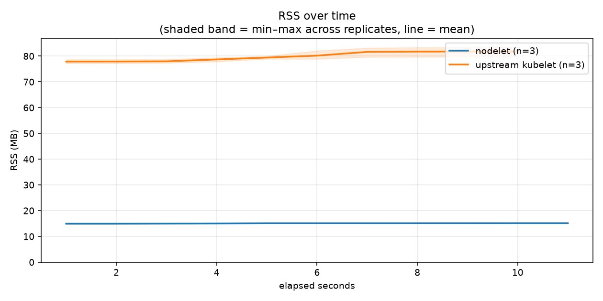
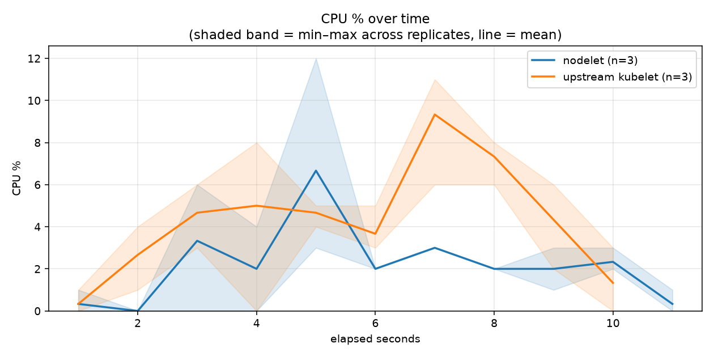
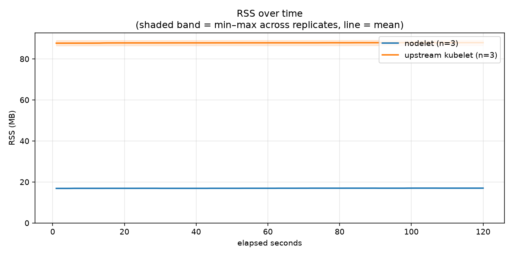
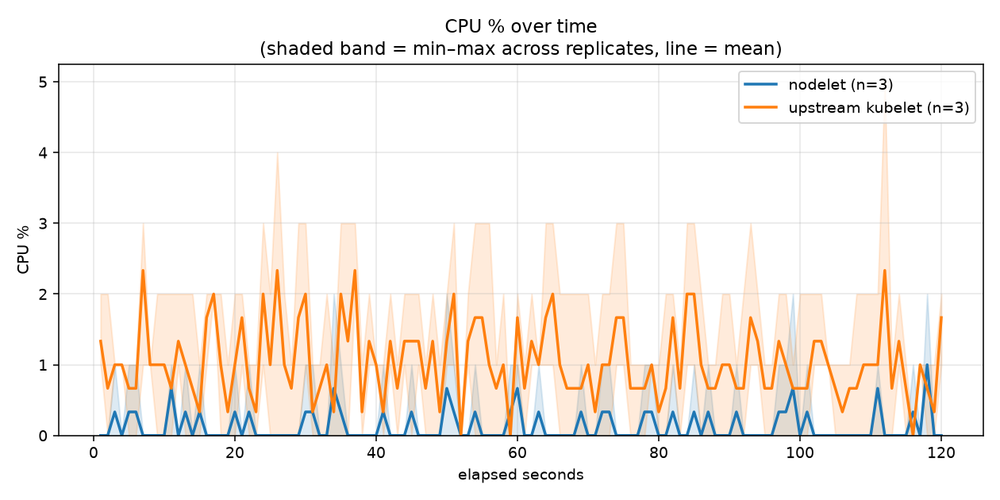
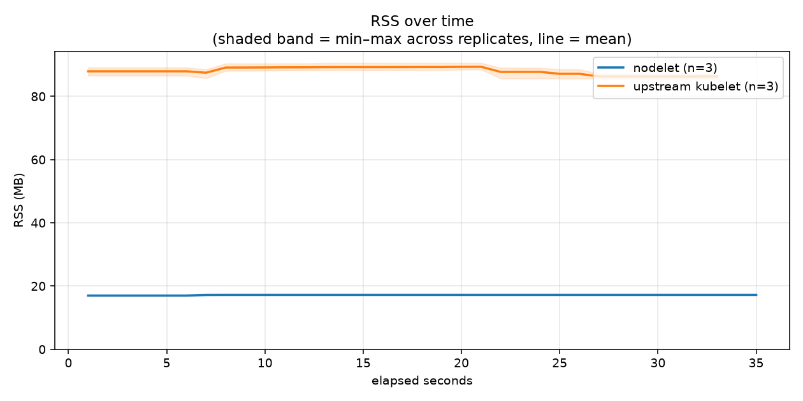
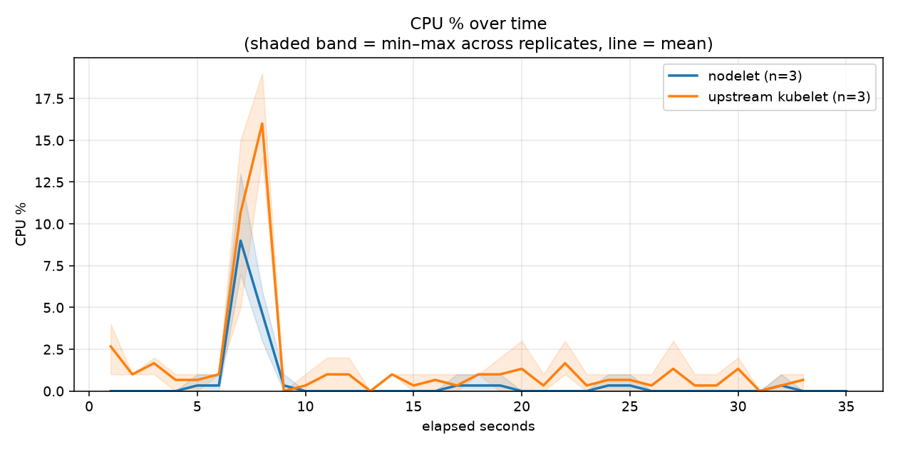

> **nodelet built from branch/ref `nodelet-idle-cpu-133`, not the pinned v0.6.0 release** — the kubelet legs below are the unchanged real-upstream-kubelet baseline.

# Workload profiling: nodelet vs a real upstream kubelet

Same stripped `k3s server --disable-agent` control plane, same containerd
— only the node agent differs. 10 namespaces (one pod each) spun up,
120s idle with them running, then spun back down. 3 independent,
identically-provisioned runners per agent (6 total, measured in parallel);
each table below is the real mean and min–max range across replicates.

Commit `76b8b6e58b6c` · 10 pods · idle window 120s, 1 sample/sec, 3 replicates/agent · [workflow run](https://github.com/centerionware/not-k8s/actions/runs/32423795548)

## Spin-up: creating 10 pods/namespaces

**Time to healthy** — wall-clock from first `kubectl apply` to every pod's `Ready` condition:

| agent | time to healthy (s) |
|---|---|
| **nodelet** | 10.67 (range 10.44–10.81, n=3) |
| **upstream kubelet** | 9.63 (range 8.83–10.52, n=3) |

**Test hardware:**

- **nodelet**: x86_64, 4 cores, `AMD EPYC 7763 64-Core Processor`
- **nodelet**: x86_64, 4 cores, `AMD EPYC 9V74 80-Core Processor`
- **upstream kubelet**: x86_64, 4 cores, `AMD EPYC 7763 64-Core Processor`
- **upstream kubelet**: x86_64, 4 cores, `Intel(R) Xeon(R) 6973P-C`

| agent | RSS (MB) | CPU-seconds used | avg CPU % | cycles | instructions | IPC |
|---|---|---|---|---|---|---|
| **nodelet** | 15.1 (range 15.0–15.2, n=3) | 0.240 (range 0.230–0.250, n=3) | 2.06 (range 2.00–2.09, n=3) | N/A | N/A | N/A |
| **upstream kubelet** | 81.8 (range 79.7–83.4, n=3) | 0.450 (range 0.370–0.490, n=3) | 4.24 (range 3.36–4.90, n=3) | N/A | N/A | N/A |

Individual replicate runs

| agent | replicate | RSS (MB) | CPU-seconds used | avg CPU % | cycles | instructions | IPC |
|---|---|---|---|---|---|---|---|
| nodelet | 1 | 15.0 | 0.240 | 2.00 | N/A | N/A | N/A |
| nodelet | 2 | 15.2 | 0.230 | 2.09 | N/A | N/A | N/A |
| nodelet | 3 | 15.1 | 0.250 | 2.08 | N/A | N/A | N/A |
| upstream kubelet | 1 | 79.7 | 0.490 | 4.90 | N/A | N/A | N/A |
| upstream kubelet | 2 | 82.3 | 0.490 | 4.45 | N/A | N/A | N/A |
| upstream kubelet | 3 | 83.4 | 0.370 | 3.36 | N/A | N/A | N/A |

## Idle, with 10 pods running

**Test hardware:**

- **nodelet**: x86_64, 4 cores, `AMD EPYC 7763 64-Core Processor`
- **nodelet**: x86_64, 4 cores, `AMD EPYC 9V74 80-Core Processor`
- **upstream kubelet**: x86_64, 4 cores, `AMD EPYC 7763 64-Core Processor`
- **upstream kubelet**: x86_64, 4 cores, `Intel(R) Xeon(R) 6973P-C`

| agent | RSS (MB) | CPU-seconds used | avg CPU % | cycles | instructions | IPC |
|---|---|---|---|---|---|---|
| **nodelet** | 17.0 (range 17.0–17.0, n=3) | 0.147 (range 0.140–0.150, n=3) | 0.12 (range 0.12–0.12, n=3) | N/A | N/A | N/A |
| **upstream kubelet** | 87.9 (range 86.6–89.1, n=3) | 1.243 (range 1.010–1.380, n=3) | 1.04 (range 0.84–1.15, n=3) | N/A | N/A | N/A |

Individual replicate runs

| agent | replicate | RSS (MB) | CPU-seconds used | avg CPU % | cycles | instructions | IPC |
|---|---|---|---|---|---|---|---|
| nodelet | 1 | 17.0 | 0.150 | 0.12 | N/A | N/A | N/A |
| nodelet | 2 | 17.0 | 0.140 | 0.12 | N/A | N/A | N/A |
| nodelet | 3 | 17.0 | 0.150 | 0.12 | N/A | N/A | N/A |
| upstream kubelet | 1 | 86.6 | 1.340 | 1.12 | N/A | N/A | N/A |
| upstream kubelet | 2 | 89.1 | 1.380 | 1.15 | N/A | N/A | N/A |
| upstream kubelet | 3 | 88.1 | 1.010 | 0.84 | N/A | N/A | N/A |

## Spin-down: deleting 10 pods/namespaces

**Time to gone** — wall-clock from first `kubectl delete` to every namespace actually removed:

| agent | time to gone (s) |
|---|---|
| **nodelet** | 35.92 (range 34.59–36.62, n=3) |
| **upstream kubelet** | 34.47 (range 32.39–36.43, n=3) |

**Test hardware:**

- **nodelet**: x86_64, 4 cores, `AMD EPYC 7763 64-Core Processor`
- **nodelet**: x86_64, 4 cores, `AMD EPYC 9V74 80-Core Processor`
- **upstream kubelet**: x86_64, 4 cores, `AMD EPYC 7763 64-Core Processor`
- **upstream kubelet**: x86_64, 4 cores, `Intel(R) Xeon(R) 6973P-C`

| agent | RSS (MB) | CPU-seconds used | avg CPU % | cycles | instructions | IPC |
|---|---|---|---|---|---|---|
| **nodelet** | 17.2 (range 17.1–17.3, n=3) | 0.167 (range 0.140–0.190, n=3) | 0.46 (range 0.39–0.54, n=3) | N/A | N/A | N/A |
| **upstream kubelet** | 89.4 (range 88.6–90.6, n=3) | 0.517 (range 0.400–0.580, n=3) | 1.49 (range 1.08–1.73, n=3) | N/A | N/A | N/A |

Individual replicate runs

| agent | replicate | RSS (MB) | CPU-seconds used | avg CPU % | cycles | instructions | IPC |
|---|---|---|---|---|---|---|---|
| nodelet | 1 | 17.3 | 0.170 | 0.46 | N/A | N/A | N/A |
| nodelet | 2 | 17.2 | 0.140 | 0.39 | N/A | N/A | N/A |
| nodelet | 3 | 17.1 | 0.190 | 0.54 | N/A | N/A | N/A |
| upstream kubelet | 1 | 88.6 | 0.580 | 1.66 | N/A | N/A | N/A |
| upstream kubelet | 2 | 89.1 | 0.570 | 1.73 | N/A | N/A | N/A |
| upstream kubelet | 3 | 90.6 | 0.400 | 1.08 | N/A | N/A | N/A |

## Raw data

Full 1-second-resolution CSVs, precise phase-duration readings, and
`deploy/measure.sh`'s complete human-readable + machine-readable output,
per replicate, under `raw-data/`:

- `raw-data/{spinup,idle-workload,teardown}/nodelet-1`/`nodelet-2`/`nodelet-3`-{timeseries,summary,duration}
- `raw-data/{spinup,idle-workload,teardown}/kubelet-1`/`kubelet-2`/`kubelet-3`-{timeseries,summary,duration}
